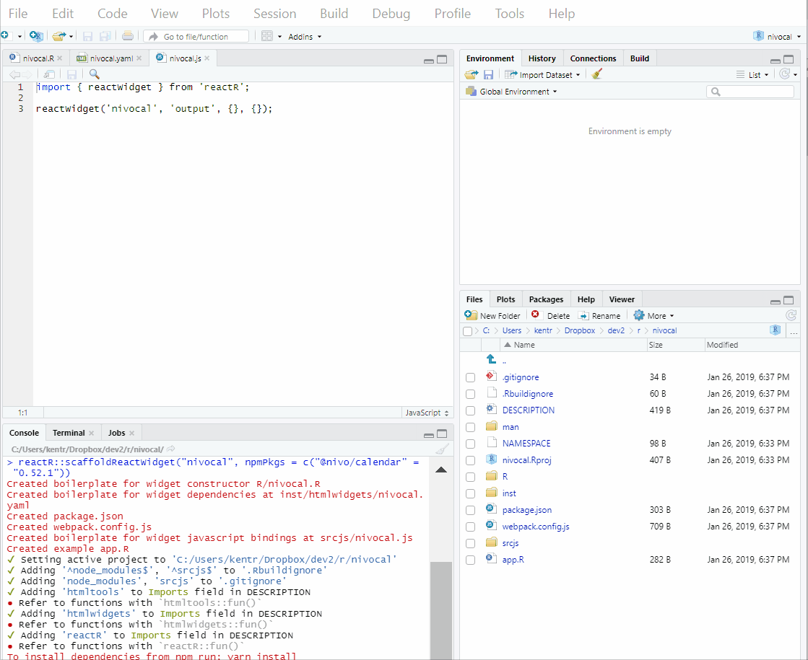
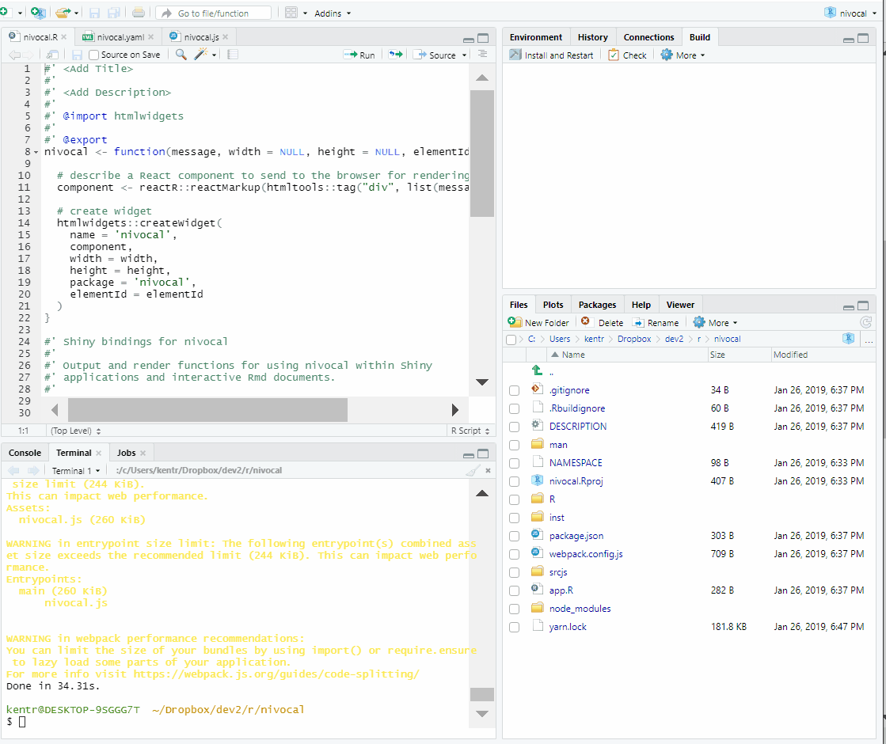
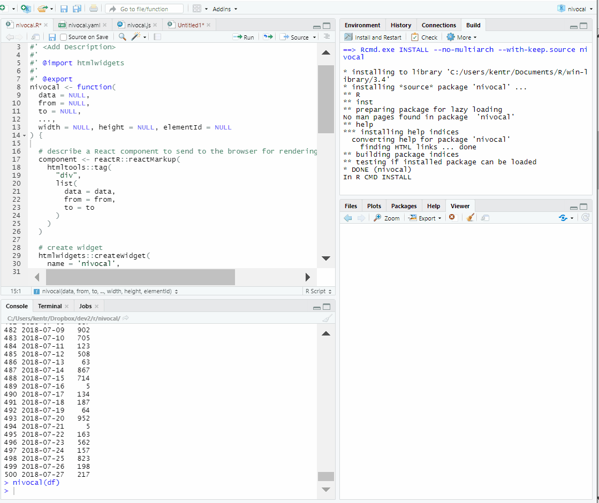
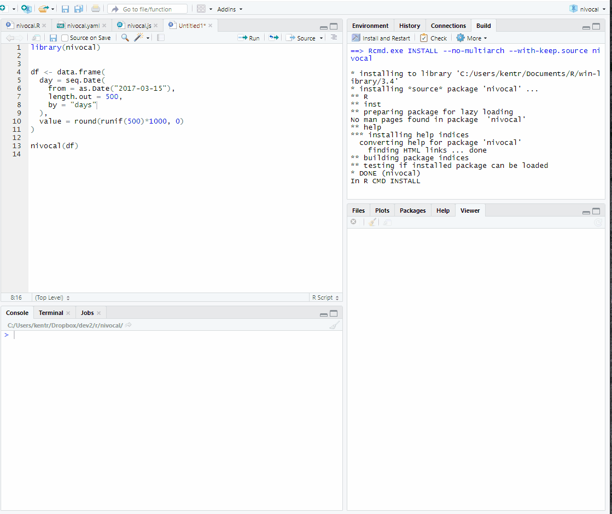
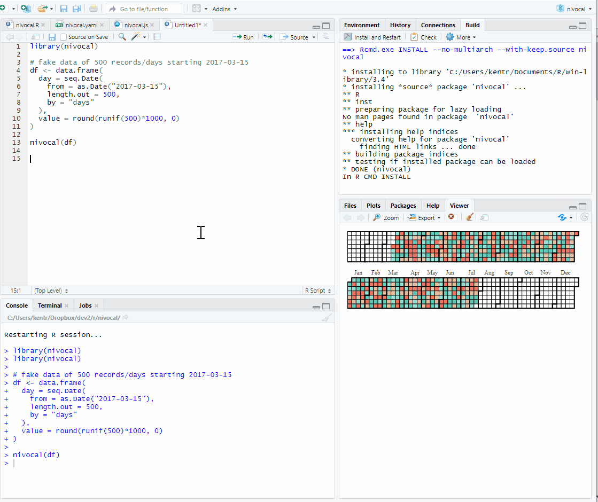

<!-- README.md is generated from README.Rmd. Please edit that file -->

# Making of nivocal

`nivocal` was built to be a working package, but while I was at it I
wanted to record each step in the creation journey as a reference for
future authors of [`reactR`](https://github.com/react-R/reactR)-based
`htmlwidgets`. For reference, the package in its initial working state
required less than 30 minutes of effort. I never left my RStudio window,
and I only had to write 1.5 lines of JavaScript.

## One Time on the Internet I Found …

There are some amazing [`React`](https://reactjs.org/) comoponents out
there. If one day on the Internet, you find something you like then it
can be ready to use in R in less than an hour (hopefully shorter if you
read this document). Take for example the
[@nivo](https://nivo.rocks/components) set of components. I’d like to
use the Github-style [calendar](https://nivo.rocks/calendar/).


## Starting the Package

[`usethis`](https://github.com/r-lib/usethis) allows us to create a
package in one line of code. Let’s begin our journey here.

``` r
usethis::create_package("nivocal")
```


## Scaffolding

Once we have a package, we’ll open it up and then build a scaffold.
Sometimes finding the `npmPkgs` argument can be a little tricky.
Usually, the best clues are in the docs, but we can also use
[unpkg.com](https://unpkg.com)–the CRAN of Node JavaScript–for some
help. End the url with `/` to see the contents of the package and find
the most recent version. For the calender, we do
<https://unpkg.com/@nivo/calendar/>. Remember the `/`. Try
<https://unpkg.com/@nivo/calendar> to see the difference.

``` r
scaffoldReactWidget(
  "nivocal",
  npmPkgs = c("@nivo/calendar" = "0.52.1")
)
```


Now we have all the files we need for a working `htmlwidget` but
unfortunately not working in the way we want.

## 1.5 Lines of JavaScript

In the JavaScript, we will need to import the module we want to use. For
`nivocal` we want `ResponsiveCalendar`. `import` in JavaScript is very
similar to `library()` in R.

``` r
import { ResponsiveCalendar } from '@nivo/calendar'
```


## Build JavaScript

The JavaScript build toolchain can get complicated, but fortunately
`reactR` takes care of much of this for us. I hate to tell you, but you
will need to install [`node`](https://nodejs.org/en/download/) and
[`yarn`](https://yarnpkg.com/lang/en/docs/install). I promise this is
not hard or scary though. Once you have both installed, we will
build/webpack our JavaScript in the RStudio terminal or other
terminal/console.

``` r
yarn install
yarn run webpack
```



The built JavaScript will be copied into the `/inst/htmlwidgets`
directory ready for use in our R `htmlwidget`.

## Build R Package

We have a couple more things to do on the `R` side. For now, let’s see
if the package builds. In RStudio, we can `CTRL + Shift + B` or

``` r
devtools::document()
devtools::install(quick = TRUE)
```



If all goes well, then our package is working, but as I said just not
quite in the way we want.

## Add Some Arguments

Now we need a way to go from R to JavaScript. We’ll add arguments for
the `data`, `from`, and `to` component `props` in our `R` function.


## Change the Tag

The scaffold uses `div`, but we want to use the `ResponsiveCalendar`
component. `React` components are always
[capitalized](https://reactjs.org/docs/jsx-in-depth.html#user-defined-components-must-be-capitalized).



## Add More Props/options and Do Some R Work

There are a lot of other options for the calendar. For a well-built R
package, I think each of these should be dcoumented arguments, but for
now we’ll use `...` to pass other options from R to JavaScript.

`data`, `from`, and `to` are required for the calendar component.
Eventually, we want to accept various forms of `data` from the user, but
for now we will assume the user provides a `data.frame` with two columns
`day` and `value`. `htmlwidgets` communicate `data.frames` as an [array
of
arrays](https://www.htmlwidgets.org/develop_advanced.html#data-transformation)
but `ResponsiveCalendar` wants the equivalent of `dataframe = "rows"` in
`jsonlite::toJSON()`. We’ll use `mapply` to do this, but as described in
the [data
transformation](https://www.htmlwidgets.org/develop_advanced.html#data-transformation)
article we have other methods to achieve this. The most common form –
using JavaScript `HTMLWidgets.dataframeToD3()` – does not currently work
well with `reactR`-based `htmlwidgets`.

Without `from` and `to`, the calendar will not render, so let’s assume
the user wants `from` to be the first row of the data and `to` to be the
last row.


## It’s Working

Now we have a working `htmlwidget`. Build the package with
`CTRL+Shift+B` or

``` r
devtools::document()
devtools::install(quick = TRUE)
```

Give it some data and see an interactive calendar.

``` r
library(nivocal)

# fake data of 500 records/days starting 2017-03-15
df <- data.frame(
  day = seq.Date(
    from = as.Date("2017-03-15"),
    length.out = 500,
    by = "days"
  ),
  value = round(runif(500)*1000, 0)
)

nivocal(df)
```



## Customize

Remember we added `...` for further customization. Let’s see how this
works.

``` r
library(nivocal)

# fake data of 500 records/days starting 2017-03-15
df <- data.frame(
  day = seq.Date(
    from = as.Date("2017-03-15"),
    length.out = 500,
    by = "days"
  ),
  value = round(runif(500)*1000, 0)
)

nivocal(
  df,
  direction = "vertical",
  colors = RColorBrewer::brewer.pal(n=9, "Blues")
)
```



## More Resources

Even though all of this is fairly new, we have tried to offer examples
and resources to ease the learning curve. The [react-R Github
organization](https://github.com/react-R) is intended to be a friendly
central location for all things R + React. Please join in the fun.

  - [Alan Dipert rstudio::conf 2019
    Video](https://resources.rstudio.com/rstudio-conf-2019/integrating-react-js-and-shiny)
    hear from the creator himself

  - [Authoring reactR htmlwidgets
    tutorial](https://react-r.github.io/reactR/articles/intro_htmlwidgets.html)

  - [react-sparklines example
    package](https://github.com/react-R/sparklines-example) great first
    example package

  - [office-fabric-ui example
    package](https://github.com/react-R/roffice) widget example with no
    JavaScript build steps

  - [MapboxGL example
    package](https://github.com/react-R/MapboxGL-example) package
    discussed in the rstudio::conf 2019 video

  - [forcer](https://github.com/react-R/forcer) `react-force-graph`
    example package for `2d`, `3d`, and virtual reality force directed
    network graphs.

## Vue

We’d like to do the same for `Vue`. Please let us know if you have
interest. [`vueR`](https://github.com/timelyportfolio/vueR) would be a
good starting point.
